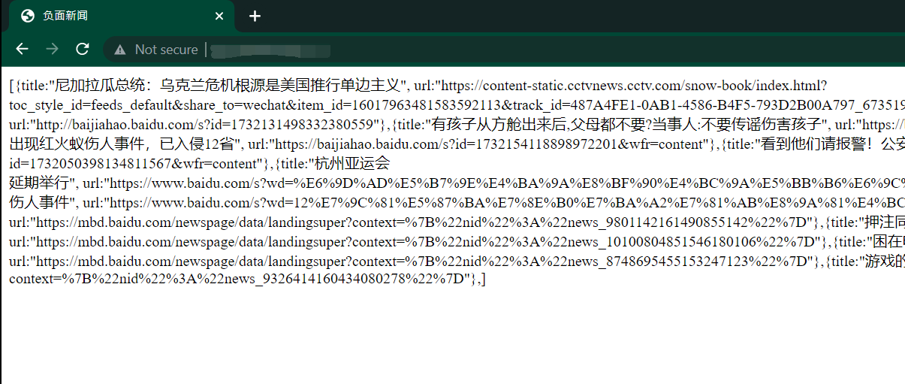

# 发现负面新闻

使用搜狗工作流，发现百度新闻上的负面新闻。


## 环境配置

环境：Ubuntu20.04

```shell
sudo apt-get install openssl libssl-dev cmake git gcc g++ libcurl4-gnutls-dev
git clone https://github.com/pennyliang/workflow.git
cd ./workflow/ 
./configure
make
sudo make install
```


## 使用方法

```shell
make
./myserver [端口号]
```


## 效果


5.7 19:55更新：



## 代码文档

使用了`tutorial-04-http_echo_server.cc`的大体框架，修改了process函数的body填写部分。具体如下：

```cpp
//修改标签页上的标题
resp->append_output_body_nocopy("<head>", 6);
resp->append_output_body_nocopy("<title>", 7);
std::string title = "负面新闻";
resp->append_output_body(title.c_str(), title.length());
resp->append_output_body_nocopy("</title>", 8);
resp->append_output_body_nocopy("</head>", 7);

resp->append_output_body_nocopy("<html>", 6);
//生成新闻标题字符串夹在<html>标签内
std::string message = genMessage();
resp->append_output_body(message.c_str(), message.length());
resp->append_output_body_nocopy("</html>", 7);
```

`genMessage()`函数是这个项目的主体函数，如下：

```cpp
std::string genMessage() {
	std::string ans;
    //获取百度新闻页面内容，存放在/tmp/get.html中
	getUrl();
	std::vector<std::vector<std::string>> result;
    
    //解析/tmp/get.html文件提取出所有的新闻标题和URL
	parse(result);
	
	// 构造json格式字符串
	ans += "[";
	for (auto news : result) {
		double num = judgeEmo(news[1]);
		if (num < -1) {
			std::cout << "an error occurred when judgeEmo()" << std::endl;
		}
		else if (num < -0.5) {
			ans += ("{title:" + news[1] + ", url:" + news[0] + "}");
		}
	}
	ans += "]";
	return ans;
}
```

`getUrl()`使用`libcurl`库来进行页面的获取并将结果存放在`/tmp/get.html`中

```cpp
bool getUrl()
{
	char* filename = "/tmp/get.html";
	CURL* curl;
	CURLcode res;
	FILE* fp;
	if ((fp = fopen(filename, "w")) == NULL)  // 返回结果用文件存储
		return false;
	struct curl_slist* headers = NULL;
	headers = curl_slist_append(headers, "Accept: Agent-007");
	curl = curl_easy_init();    // 初始化
	if (curl)
	{
		curl_easy_setopt(curl, CURLOPT_HTTPHEADER, headers);   // 改协议头
		curl_easy_setopt(curl, CURLOPT_URL, "http://news.baidu.com");
		curl_easy_setopt(curl, CURLOPT_WRITEDATA, fp);         //将返回的内容输出到fp指向的文件
		res = curl_easy_perform(curl);   // 执行
		if (res != 0) {
			curl_slist_free_all(headers);
			curl_easy_cleanup(curl);
		}
		fclose(fp);
		return true;
	}
	return false;
}
```

`parse(std::vector<std::vector<std::string>> result)`使用正则表达式匹配新闻标题，将标题和URL以二维vector的形式存放在`ans`引用里。

```cpp
void parse(std::vector<std::vector<std::string>>& ans) {
	const std::regex pattern("<a href=\"(http.*?)\".*>(.{20,})</a>");
	char* filename = "/tmp/get.html";
	std::fstream input_file(filename);
	if (!input_file.is_open()) {
		std::cerr << "Could not open the file - '"
			<< filename << "'" << std::endl;
		exit(EXIT_FAILURE);
	}
	std::stringstream ss;
	ss << input_file.rdbuf();
	const std::string text = ss.str();
	// std::cout << text << std::endl;

	std::smatch result;
	auto begin = text.begin();
	auto end = text.end();
	for (; std::regex_search(begin, end, result, pattern); begin = result.suffix().first) {
		std::vector<std::string> temp;
		//std::cout << result.str() << std::endl;
		temp.push_back(result.str(1));
		temp.push_back(result.str(2));
		ans.push_back(temp);
	}
}
```

`judgeEmo(std::string str)`通过`popen`执行shell系统调用，调用情感计算API，详见[这里](http://www.pullword.com/baobian/)，用正则表达式的匹配来获得返回的数值。

```cpp
double judgeEmo(std::string str) {
	std::string command = "curl -s -X POST 'http://baobianapi.pullword.com:9091/get.php' -d'" + str + "' --compressed";
	FILE* fp = popen(command.c_str(), "r");
	char buffer[40] = { 0 };
	if (fp != NULL) {
		fgets(buffer, sizeof(buffer), fp);
	}
	else {
		return -3;
	}
	std::string jsonres(buffer);
	// std::cout << jsonres << std::endl;
	const std::regex pattern("\\{\"result\":(.*)\\}");
	std::smatch result;
	if (std::regex_match(jsonres, result, pattern)) {
		return stod(std::string(result.str(1)));
	}
	return -2;
}
```

